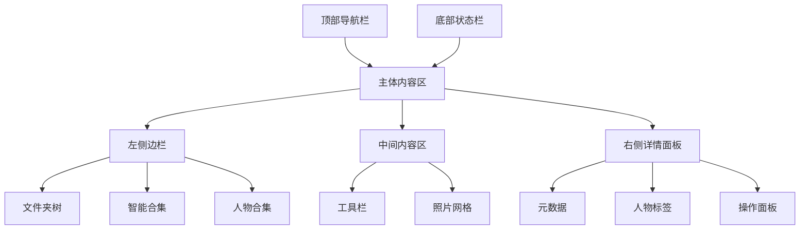

# Lumen 照片管理软件 - UI/UX 设计需求文档

## 1. 设计概述

### 1.1 项目背景

Lumen 是一款基于 Tauri 和 React 的现代化桌面照片管理软件，旨在为用户提供直观、高效的照片管理体验。名称"Lumen"寓意"光明"，象征着帮助用户清晰整理和回顾美好记忆。

### 1.2 设计目标

- **直观性**：零学习成本，用户能够立即上手
- **效率性**：快速浏览、搜索和管理大规模照片库
- **美观性**：现代化设计语言，突出照片内容本身
- **一致性**：跨平台统一的视觉体验
- **可访问性**：符合 WCAG 2.1 标准，支持不同用户需求

### 1.3 目标用户

- **摄影爱好者**：需要管理大量照片，重视元数据和分类
- **普通用户**：希望简单整理家庭照片和旅行回忆
- **内容创作者**：需要快速查找和整理素材

## 2. 设计系统规范

### 2.1 色彩系统

#### 2.1.1 主色彩方案

#### 2.1.2 深色/浅色主题

### 2.2 字体系统

#### 2.2.1 字体栈

```css
/* 字体配置 */
:root {
  --font-sans: 'Inter', -apple-system, BlinkMacSystemFont, sans-serif;
  --font-mono: 'JetBrains Mono', 'Fira Code', monospace;
}

/* 字体大小层级 */
.text-xs {
  font-size: 0.75rem;
}
.text-sm {
  font-size: 0.875rem;
}
.text-base {
  font-size: 1rem;
}
.text-lg {
  font-size: 1.125rem;
}
.text-xl {
  font-size: 1.25rem;
}
.text-2xl {
  font-size: 1.5rem;
}
```

### 2.3 间距系统

基于 4px 网格系统：

```css
.spacing-1 {
  padding: 0.25rem;
} /* 4px */
.spacing-2 {
  padding: 0.5rem;
} /* 8px */
.spacing-3 {
  padding: 0.75rem;
} /* 12px */
.spacing-4 {
  padding: 1rem;
} /* 16px */
.spacing-6 {
  padding: 1.5rem;
} /* 24px */
```

### 2.4 阴影系统

```css
.shadow-sm {
  box-shadow: 0 1px 2px 0 rgb(0 0 0 / 0.05);
}

.shadow-md {
  box-shadow: 0 4px 6px -1px rgb(0 0 0 / 0.1);
}

.shadow-lg {
  box-shadow: 0 10px 15px -3px rgb(0 0 0 / 0.1);
}
```

## 3. 布局设计

### 3.1 整体布局结构



### 3.2 响应式断点

| **断点** | **尺寸**        | **布局变化** |
| -------- | --------------- | ------------ |
| 紧凑模式 | < 1024px        | 侧边栏可折叠 |
| 标准模式 | 1024px - 1440px | 三栏布局     |
| 宽屏模式 | > 1440px        | 增加照片列数 |

## 4. 核心页面设计

### 4.1 主界面 - 照片库

#### 4.1.1 布局规范

```
┌─────────────────────────────────────────────────────────────┐
│ 🏠 Lumen · 照片库                    [搜索框] [排序] [视图] │
├───────────────┬───────────────────────────────┬─────────────┤
│ 📁 文件夹树   │                               │ ℹ️ 详情面板 │
│ · 图片库      │    🖼️🖼️🖼️ 照片网格           │ 拍摄时间    │
│ · 桌面        │    🖼️🖼️🖼️ 🖼️🖼️🖼️            │ 相机信息    │
│ · 下载        │    🖼️🖼️🖼️ 🖼️🖼️🖼️            │ 地理位置    │
│ · 最近添加    │                               │ 人物标签    │
│               ├───────────────────────────────┤             │
│ 👥 人物合集   │       选中照片预览            │ 操作按钮    │
│ · 未命名人物1 │        [大图显示]             │ · 添加到合集│
│ · 人物A       │                               │ · 编辑元数据│
│ · 人物B       │                               │ · 重命名    │
└───────────────┴───────────────────────────────┴─────────────┤
│ 已选择 5 个项目 · 总计 1,247 张照片 · 存储使用 15.2 GB     │
└─────────────────────────────────────────────────────────────┘
```

#### 4.1.2 交互细节

- **照片网格**：悬停显示操作按钮（收藏、添加到合集）
- **多选操作**：Shift+点击连续选择，Ctrl+点击多选
- **拖拽排序**：支持拖拽调整照片顺序
- **键盘导航**：方向键浏览，空格键预览

### 4.2 照片预览界面

#### 4.2.1 布局规范

```
┌─────────────────────────────────────────────────────────────┐
│ × 关闭 ◀ ▶ 1/247                  [下载] [分享] [删除]      │
├─────────────────────────────────────────────────────────────┤
│                                                             │
│                   🖼️ 当前照片大图预览                       │
│                                                             │
├─────────────────────────────────────────────────────────────┤
│ [缩略图1] [缩略图2] [缩略图3] ... [缩略图10] ▶              │
└─────────────────────────────────────────────────────────────┘
```

#### 4.2.2 交互细节

- **手势支持**：鼠标滚轮缩放，拖拽平移
- **键盘快捷键**：ESC退出，←→切换照片
- **触摸支持**：双指缩放，滑动切换

### 4.3 人物管理界面

#### 4.3.1 布局规范

```
┌─────────────────────────────────────────────────────────────┐
│ 👥 人物管理                     [添加人物] [训练模型]       │
├─────────────────────────────────────────────────────────────┤
│ 🧑 人物A (142)  🧑 人物B (89)   🧑 人物C (56)   🧑⁺ 未命名 │
│                                                             │
│ 选中人物：人物A                                             │
│ 🖼️🖼️🖼️🖼️🖼️🖼️🖼️🖼️🖼️🖼️🖼️🖼️🖼️🖼️🖼️🖼️🖼️🖼️🖼️🖼️              │
│                                                             │
│ 姓名：人物A · 照片数：142 · 识别准确率：92%                 │
│ [编辑姓名] [合并到...] [调整识别]                           │
└─────────────────────────────────────────────────────────────┘
```

## 5. 组件设计规范

### 5.1 照片卡片组件 (MediaCard)

```typescript
// 组件属性定义
interface MediaCardProps {
  media: MediaItem;
  isSelected: boolean;
  showCheckbox: boolean;
  onSelect: (mediaId: string) => void;
  onPreview: (media: MediaItem) => void;
  size?: 'sm' | 'md' | 'lg';
}

// 视觉状态
const cardStates = {
  normal: 'opacity-100 shadow-sm',
  selected: 'ring-2 ring-primary-500 shadow-md',
  hover: 'shadow-md scale-105 transition-transform',
};
```

### 5.2 工具栏组件 (Toolbar)

```typescript
interface ToolbarProps {
  selectedCount: number;
  viewMode: 'grid' | 'list';
  sortBy: SortOption;
  onViewModeChange: (mode: 'grid' | 'list') => void;
  onSortChange: (sort: SortOption) => void;
  onImport: () => void;
}

// 工具栏操作项
const toolbarActions = [
  { id: 'import', icon: Upload, label: '导入照片' },
  { id: 'select', icon: CheckSquare, label: '选择' },
  { id: 'sort', icon: ArrowUpDown, label: '排序', dropdown: true },
  { id: 'view', icon: LayoutGrid, label: '视图模式', toggle: true },
];
```

### 5.3 侧边导航组件 (Sidebar)

```typescript
interface SidebarProps {
  folders: FolderItem[];
  collections: CollectionItem[];
  people: PersonItem[];
  currentPath: string;
  onPathChange: (path: string) => void;
  collapsed: boolean;
  onCollapse: (collapsed: boolean) => void;
}

// 导航项类型
const navItems = [
  {
    type: 'folder',
    icon: Folder,
    label: '文件夹',
    items: folders,
    expandable: true,
  },
  {
    type: 'people',
    icon: Users,
    label: '人物',
    items: people,
    badge: people.filter((p) => !p.name).length,
  },
];
```

## 6. 交互设计规范

### 6.1 动画与过渡

#### 6.1.1 微交互动画

```css
/* 照片加载动画 */
@keyframes mediaLoad {
  from {
    opacity: 0;
    transform: scale(0.95);
  }
  to {
    opacity: 1;
    transform: scale(1);
  }
}

.media-card {
  animation: mediaLoad 0.3s ease-out;
}

/* 悬停动效 */
.media-card:hover {
  transition: all 0.2s ease-in-out;
}
```

#### 6.1.2 页面过渡

```typescript
// 路由过渡配置
const pageTransitions = {
  enter: 'transform ease-in-out duration-300 transition',
  enterFrom: 'translate-x-4 opacity-0',
  enterTo: 'translate-x-0 opacity-100',
  leave: 'transform ease-in-out duration-300 transition',
  leaveFrom: 'translate-x-0 opacity-100',
  leaveTo: '-translate-x-4 opacity-0',
};
```

### 6.2 加载状态设计

#### 6.2.1 骨架屏

```typescript
// 照片网格骨架屏
const MediaGridSkeleton: React.FC = () => (
  <div className="grid grid-cols-5 gap-4">
    {Array.from({ length: 20 }).map((_, i) => (
      <div key={i} className="aspect-square bg-gray-200 animate-pulse rounded-lg" />
    ))}
  </div>
);
```

#### 6.2.2 进度指示器

```typescript
// 导入进度组件
const ImportProgress: React.FC<{ progress: number; currentFile: string }> = ({
  progress,
  currentFile
}) => (
  <div className="fixed bottom-4 right-4 bg-surface shadow-lg rounded-lg p-4 w-80">
    <div className="flex justify-between text-sm mb-2">
      <span>导入中...</span>
      <span>{progress}%</span>
    </div>
    <Progress value={progress} className="w-full" />
    <p className="text-xs text-gray-500 mt-1 truncate">{currentFile}</p>
  </div>
);
```

## 7. 可访问性设计

### 7.1 键盘导航支持

```typescript
// 键盘快捷键映射
const keyboardShortcuts = {
  ArrowRight: '下一张照片',
  ArrowLeft: '上一张照片',
  Space: '切换预览',
  Escape: '退出预览/关闭对话框',
  'Ctrl+A': '全选',
  Delete: '删除选中项',
  F2: '重命名',
};

// 焦点管理
const focusManagement = {
  photoGrid: '使用Tab在照片间导航，Enter打开预览',
  toolbar: '使用方向键在工具间切换',
  sidebar: '使用上下箭头在目录间导航',
};
```

### 7.2 屏幕阅读器支持

```html
<!-- ARIA 标签示例 -->
<div role="grid" aria-label="照片网格" aria-describedby="photo-count">
  <div
    role="gridcell"
    aria-label="照片名称：{name}，拍摄时间：{date}"
    tabindex="0"
  >
    
  </div>
</div>
```

## 8. 设计交付物要求

### 8.1 设计文件格式

- **主要设计工具**：Figma
- **交付格式**：Figma 源文件 + PDF 说明文档
- **版本控制**：使用 Figma 版本历史功能

### 8.2 设计系统组件库

在 Figma 中建立完整的组件库，包含：

- ✅ 基础组件（按钮、输入框、选择器等）
- ✅ 布局组件（导航、侧边栏、工具栏等）
- ✅ 业务组件（照片卡片、人物标签、元数据面板等）
- ✅ 图标系统（SVG 格式，多种尺寸）

### 8.3 设计标注规范

每个设计页面需要包含：

- **尺寸标注**：元素间距、大小、对齐方式
- **颜色标注**：色值、透明度、使用场景
- **交互状态**：正常、悬停、点击、禁用状态
- **动效说明**：过渡时间、缓动函数、触发条件

## 9. 设计验收标准

### 9.1 视觉验收标准

- [ ] 颜色使用符合设计系统规范
- [ ] 字体层次清晰，阅读体验良好
- [ ] 间距一致，符合 4px 网格系统
- [ ] 图标风格统一，大小适中

### 9.2 交互验收标准

- [ ] 所有交互元素有明确的反馈状态
- [ ] 动画流畅，不卡顿不掉帧
- [ ] 键盘导航完整支持
- [ ] 加载状态有合适的占位设计

### 9.3 可用性验收标准

- [ ] 主要功能在 3 次点击内可达
- [ ] 重要操作有确认提示
- [ ] 错误状态有明确的恢复路径
- [ ] 符合 WCAG 2.1 AA 可访问性标准

## 10. 设计里程碑

### 10.1 设计阶段计划

| **阶段**     | **时间** | **交付物**           | **评审重点**   |
| ------------ | -------- | -------------------- | -------------- |
| **设计系统** | 第1周    | 色彩、字体、组件规范 | 一致性、扩展性 |
| **核心页面** | 第2-3周  | 主界面、预览界面     | 用户体验流程   |
| **交互细节** | 第4周    | 动效、状态设计       | 交互流畅性     |
| **验收优化** | 第5周    | 完整设计稿           | 符合开发需求   |

### 10.2 设计评审流程

1. **内部评审**：设计团队内部审查
2. **产品评审**：与产品经理确认需求符合度
3. **技术评审**：与开发确认技术可行性
4. **用户测试**：小范围用户可用性测试

---

**文档版本**：1.0  
**最后更新**：2025年9月25日  
**设计负责人**：待指定  
**开发对接人**：待指定

此设计需求文档将为 Lumen 照片管理软件提供完整的视觉和交互指导，确保最终产品在美观性、可用性和一致性方面达到高标准。
